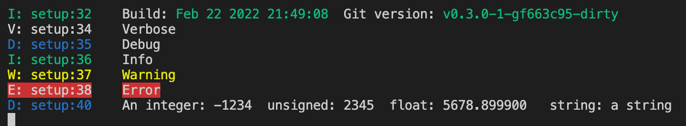

              
# Purpose

This library is a collection of useful utilities for Arduino development, especially with PlatformIO. It 
contains the following components:

- **rr_DebugUtils** provides an interface for debug output to terminal. The code is only included in debug builds and 
does not consume program space in the release build. 
Additionally it provides an interface to show to git version and build of a program.

- **rr_Intervall** provides an interface for task which should be executed periodically in a programm. Additionally it provides
statistical functions to analyse program behauviour.

- **rr_Common** provides useful macros for range checking and other debug tasks like printing the IDs connected
  to a I2C-bus.

- **documentation** provides a build target to produce source code documentation with doxgen. 
It is invoked with `pio run - t doc`

- **library packaging** provides a build target to package a PlatformIO library. 
It is invoked with `pio run - t package`

# Installation

- set `libs_deps=https://github.com/resterampeberlin/RRArduinoUtilities.git` in `platformio.ini`

# Memory consumption

Tested with target UNO and `main.cpp`

| Environment        | RAM | Flash | Delta Flash | Comment                    |
| ------------------ | --- | ----- | ----------- | -------------------------- |
| uno_release        | 25  | 1014  | 0           | release build              |
| uno_debug_no_stats | 380 | 6484  | + 5470      | no statistics in Intervall |
| uno_debug_no_fp    | 390 | 6858  | + 374       | fp printf disabled         |
| uno                | 390 | 8330  | + 1472      | all features enabled       |

Be careful with memory consumption, especially the floating point version could make a UNO or NANO unusable

Additionally the define RR_DEBUG_LOCATION influences memory consumption. See source code rr_DebugUtils.h for details.

# Generate Doxygen source code documentation

In order to document your source code you need 3 components:

1. doxygen installed (e.g. on Mac OS X `brew install doxygen`)
2. A doxygen configation file `Doxyfile` in the project directory. Create it from scratch with `doxygen -g`
3. Documented source code (see [doxygen documentation](https://www.doxygen.nl/) for details)

When ypu invoke `pio run - t doc` the documentation will be produced. 

The following settings in the 'Doxyfile' will be automatically set with this command:
- **PROJECT_NUMBER** will be replaced by 'git tag'
- **PROJECT_BRIEF** will be replaced by library description in `library-template.json`
- **PROJECT_NAME** will be replaced by library name in `library-template.json`

The last two points are only applicable if you build a library. 
For a project you should set those values in `Doxyfile`

Run the following command to create the documntation

        pio run -t doc

# Create a PlatformIO library and package it

Run the following command to create a `.tar.gz` library

        pio run -t package

This command will ensure that the current git tag is set as `version`in `library.json`

# Documentation

For source code documentation see this [page](https://resterampeberlin.github.io/rr_ArduinoUtils/).

# Credits

This open source code project is has been proudfully produced in Berlin (and other places around the globe) by

